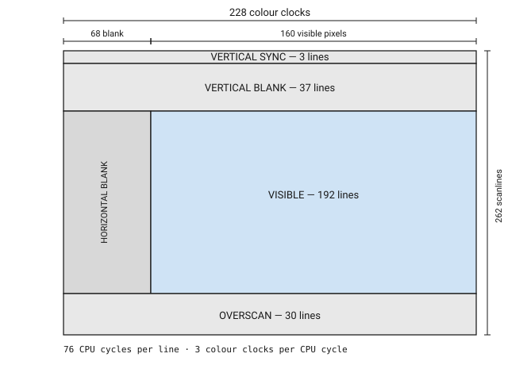

# Player1DSL: language and compiler specification (draft 0.1)

**Status:** Proposal for review  
**Target:** NTSC Atari 2600-compatible ROMs playable in Stella and compatible emulators  
**Primary audience:** Game designers, hobbyists, and developers who want readable game code without needing to hand-time 6502 assembly.

## 1. Product intent

Player1DSL is a source language and compiler for creating original, cartridge-style Atari 2600 games. A program describes *what* the game contains—scenes, objects, rules, controls, score, sound, and art—while the compiler creates an NTSC or PAL 2600 ROM and reports whether the requested visual design fits the actual machine.

The language must preserve the character and real constraints of the Atari 2600 rather than merely draw an Atari-looking game in a modern framebuffer. Its output is cycle-aware 6502/TIA code, runs as a `.bin` ROM in Stella, and should also run in other 2600 emulators and on compatible hardware where the selected cartridge scheme is supported.

The guiding experience is:

```p1
game "Star Hopper" target ntsc

player ship using ship_art at (76, 156) controls joystick1
enemy  drone using drone_art spawn every 90 frames

when ship hits drone:
  score += 10
  destroy drone
```

The author thinks in game terms. The compiler remains honest about the machine terms: scanlines, TIA objects, ROM/RAM budgets, input, collision latches, and per-line CPU-cycle budgets.

## 2. Goals and non-goals

### Goals

- Compile readable `.p1` source into a real Atari 2600 ROM.
- Make a small, teachable language usable by non-developers, but retain escape hatches for advanced authors.
- Provide built-in patterns inspired by classic 2600 game genres—Pong/Combat, Breakout, Space Invaders, Adventure, Freeway, River Raid, and Pitfall-style scenes—without shipping copied games, ROMs, artwork, or code.
- Model actual TIA resources and automatically schedule safe multiplexing techniques when requested.
- Diagnose impossible or risky scenes before producing a ROM, with actionable suggestions rather than opaque assembler failures.
- Produce reproducible builds, debug symbols/source maps, a listing, and optional scanline/cycle reports.
- Support a reasoning-assisted import workflow that converts an author-provided, legally usable existing ROM/source/disassembly into a proposed Player1DSL project for review; it must never claim a perfect or copyright-cleared reconstruction.

### Non-goals for v0.1

- A general-purpose cross-platform engine or a modern GPU-style sprite system.
- Arbitrary C/JavaScript extensions in the game runtime.
- Exact decompilation of every commercial ROM into semantically named source.
- Automatic rights clearance, distribution of third-party ROMs, or bypassing copy protection.
- Guaranteeing a design will behave identically on every historical television or clone console. Target emulators first, then test hardware as a separate compatibility tier.

## 3. Platform contract

The initial compiler targets the original 2600 execution model:

- 6507-compatible CPU, TIA video/audio, and RIOT I/O/timer model.


- The RIOT interval timer (`TIM64T` and friends, polled through `INTIM`) is the mechanism that bounds VBLANK and overscan work. It is what makes §4.3's claim that per-frame rules fit in non-visible time enforceable at runtime rather than merely asserted at compile time.
- Timer arithmetic is not obvious: a timer write's first decrement lands on the **next cycle**, not after a full prescaler interval, so zero is reached at `1 + (N-1) * interval` cycles rather than `N * interval`. Constants derived without this are off by a scanline. Measured; see `examples/tank-arena/reference/NOTES.md`.
- v0.1 is NTSC-only. PAL and PAL60 are deferred until timing and regression tests are mature.
- A visible frame is modeled as a scanline program, not a framebuffer. NTSC uses the conventional 3 VSYNC + 37 VBLANK + 192 visible + 30 overscan-line layout.
- Native movable graphics are two 8-bit player objects, two missiles, and a ball, alongside the playfield. The compiler may reuse/reposition objects during a line (multiplexing) only when a selected technique and cycle budget permit it.
- Initial cartridge output: 4 KiB unbanked only. 8 KiB F8 bankswitching follows in phase 2 (see §12); later releases may add other well-defined mapper profiles.
- Initial controller support: joystick (one button) and console switches. Paddles are deferred: they are read by timing a capacitor charge through the INPT ports, which costs cycles inside the same non-visible budget §4.3 already rations, so they are a later profile rather than a small addition.

The compiler must emit a mapper declaration into build metadata and use a ROM layout that Stella can identify or that can be explicitly configured.

## 4. Language model

### 4.1 Project and source files

A project has a `game.p1` entry file plus optional scene, art, sound, and library files. Indentation defines blocks. Comments start with `#`. Names are lower snake case. Numeric values are decimal by default, with `px`, `lines`, `frames`, `hz`, and `ticks` units where meaningful.

The source language has four layers, all available in one project:

1. **Game layer** — entities, state, rules, scenes, timers, scoring, input, and sound cues.
2. **Display layer** — playfields, sprites, bands, HUD, colors, and placement intent.
3. **Scheduling layer** — selectable rendering strategies and performance constraints.
4. **Expert layer** — named TIA/RIOT operations and scanline blocks, isolated from ordinary game code and statically checked where possible.

### 4.2 Core declarations

```p1
game "Canyon Run"
target ntsc
cartridge 4k

palette canyon:
  sky       = $84
  ground    = $2A
  player    = $4E

sprite jeep 8x12:
  ........
  .XX..XX.
  XXXXXXXX
  ..XXXX..
  .X.XX.X.
  XXXXXXXX
  XX....XX
  .X....X.
  .X....X.
  ........
  ........
  ........

scene play:
  background sky
  playfield road, mode reflect
  actor jeep_player uses jeep at (76, 150) controls joystick1
  score at top_right
```

Data types in v0.1: `bool`, `byte` (0–255), signed `int8`, fixed-point `position`, `color`, `sprite`, `sound`, and bounded arrays. Types and bounds are deliberately small enough to map predictably into RAM.

### 4.3 Rules and update timing

```p1
every frame:
  jeep_player.move with joystick1 speed 2
  if button1 pressed:
    fire bullet from jeep_player

when bullet hits enemy:
  score += 10
  sound explode
  destroy enemy

every 120 frames:
  spawn enemy from right at y random(32..160)
```

`every frame` runs in VBLANK/overscan. The compiler rejects unbounded work that cannot fit the available non-visible CPU time.

That rejection is a worst-case execution time analysis, and it is only tractable because
the game layer is **statically bounded by construction**: no unbounded loops, no
recursion, no indirect calls, and only bounded arrays with compile-time-known extents.
Every construct therefore has a statically computable cycle bound, and the bound of a
rule is the sum of its parts. This is the single most consequential constraint in the
language, and it is what §2's "no arbitrary C/JavaScript extensions in the game runtime"
non-goal exists to protect. Iteration is available only through forms whose trip count is
fixed at compile time; anything else is a diagnostic, not a slow program. `when A hits B` uses TIA collision latches when the rendering plan maps the pair to compatible TIA objects; otherwise the compiler generates bounded software collision checks and reports their cost.

Two properties of the hardware latches constrain what `when A hits B` can mean:

- **Latches report object pairs, not actors.** A latch says *a* collision occurred between two TIA objects. Where one player object is multiplexed across several logical actors, it cannot say *which* actor was involved. So hardware collision is available only while the rendering plan gives A and B their own objects — precisely the condition `strategy multiplex` (§5.2) destroys. Selecting multiplex silently converts every identity-dependent rule to software collision, and the report must say so.
- **Latches are level, not edge.** They remain set for every frame two objects overlap, and accumulate until `CXCLR`. Scoring a *hit* therefore needs edge detection the hardware does not provide: `score += 10` implies a per-contact latch in RAM that the compiler must generate, not a direct read.

The conventional contract is to read latches after the visible region and clear them during vertical blank.

### 4.4 Scenes, bands, and playfields

A scene is a complete rendering/update policy. A scene contains one or more vertical `band`s. Bands express areas whose display behavior is stable, such as a score row, play area, river, or ground.

```p1
scene play:
  band hud height 12:
    score at (124, 2) style bcd

  band field from 12 to 180:
    background sky
    playfield terrain, mode reflect, resolution 2
    actor player_ship uses ship at (72, 144)
    swarm invaders uses invader count 12 strategy auto

  band footer height 12:
    lives icons ship count lives
```

> **Open: band boundaries are not free, and this example does not fit.**
>
> The bands above sum to exactly 192 with nothing budgeted between them. A real boundary
> costs visible scanlines whenever objects must change position across it — and they must
> whenever a band reuses P0/P1, which is unavoidable given there are only two.
>
> Measured on the reference kernel (`examples/tank-arena/reference/NOTES.md`): a
> HUD-to-field boundary repositioning both players cost **five** visible scanlines — two
> per object, plus one to absorb the `HMOVE` comb, which blanks 8 pixels on whatever line
> `HMOVE` is strobed and can only be *placed*, never suppressed.
>
> That five is **not a constant**, which is why no number is specified here yet. It
> depends on how many objects cross the boundary and whether a line exists whose
> background can hide the comb. There is also a *phase* constraint the model does not
> express: register writes at a boundary must complete before the beam reads them, so a
> boundary following a loop exit — which leaves no horizontal blank — needs either a
> `WSYNC` or writes ordered by deadline.
>
> The cost model is deferred to step 3 (see `docs/roadmap.md`), which produces a second
> data point by making the compiler emit a transition rather than copy one. Until then,
> treat the band syntax as settled and the boundary accounting as unspecified.

`playfield` supports `repeat`, `reflect`, and `asymmetric` modes. `reflect` is the only
spelling: it is one hardware bit (`CTRLPF` D0), and an earlier draft used `mirror` and
`reflect` interchangeably for it. The compiler displays a preview grid indicating the
physical 20-bit playfield constraints — PF0 contributes only 4 bits, so the narrowest
expressible feature is 4 pixels wide.

### 4.5 Assets

Sprites are 1-bit 8-pixel-wide shapes with a color per scanline or a declared color regime. Authors can use inline pixel art or import PNGs through a tool that quantizes/crops them and presents the resulting `.p1` asset for review. Sound is authored in a small event notation matching the two TIA audio channels.

```p1
sound laser:
  channel 0 tone 4 frequency 22 volume 8 for 6 frames

sound engine:
  channel 1 noise 2 frequency 9 volume 3 loop
```

## 5. More-than-two-sprite abstraction

The 2600 does not contain a conventional multi-sprite renderer. Player1DSL must make that visible without making authors hand-code raster tricks.

### 5.1 The two axes are not alike

Actors carry `(x, y)` everywhere in this document, and that symmetry is a fiction the
compiler has to unpick. The two coordinates are different kinds of thing on this machine:

- **`x` is a register.** Horizontal position is real state, set by strobing `RESPx` for
  coarse placement and trimming with `HMPx` + `HMOVE`. It costs cycles (§4.4) but it is
  a value the hardware holds.
- **`y` is not.** There is no vertical position register. An object's vertical position
  *is* the set of scanlines on which the kernel writes `GRPx` — so `y` is a property of
  the generated kernel's structure, not of a variable the kernel reads. Moving an actor
  down the screen means the kernel's per-line comparison selects a different range of
  lines, and every distinct `y` a band must support is a constraint on the loop body that
  band's kernel can afford.

This is the actual reason 2600 games look the way they do, and it bounds how many
distinct vertical positions can coexist in one band far more tightly than the horizontal
multiplexing table below suggests. A band's kernel must recompute each object's graphics
row within its per-line budget; two objects at arbitrary independent `y` is affordable,
twelve is not, regardless of how their horizontal positions resolve.

`VDELP0`/`VDELP1` are the standard tool here: they delay a `GRPx` write by one line so an
object can be updated across the write boundary without tearing, which is what makes some
otherwise-unschedulable vertical layouts fit. The rendering model document owes this a
full treatment; what belongs in the specification is that vertical position is kernel
structure, and the planner must budget it as such.

### 5.2 Horizontal strategies

An `actor` is a logical game object; it is not a promise of a dedicated hardware player. An actor group can request a strategy:

```p1
swarm invaders uses alien count 12:
  layout grid columns 6 spacing (22, 16)
  strategy auto
  priority gameplay
```

The compiler tries, in this order, based on the author’s declared preferences:

| Strategy | What it does | Typical use | Main limitation |
|---|---|---|---|
| `native` | Maps to P0/P1/M0/M1/ball | two prominent actors, shots | hard object count |
| `copies` | Uses TIA player-copy modes | formations with fixed spacing | copies share art/color/vertical shape |
| `multiplex` | Repositions/reloads an object later in a scanline | rows of enemies, roadside objects | requires enough horizontal separation and cycles |
| `kernel` | Uses a specialized per-scanline renderer | game-specific visual layouts | restricted layout contract, compiler-selected template |
| `playfield` | Converts suitable static geometry to PF | walls, tracks, terrain | low horizontal resolution/pattern constraints |
| `flicker` | Alternates logical objects across frames | optional low-priority objects | visible flicker; opt-in only |

`auto` selects the least-invasive strategy that preserves declared priorities. `native` forbids substitution; `flicker` is never selected unless the project enables it. A developer can lock a rendering plan to keep a known visual result stable.

Example diagnostic:

```text
E230 scene play / band field / swarm invaders:
  12 aliens require 3 Player0 multiplex events on scanline 84.
  The current art update, color change, and score kernel leave 51 cycles;
  66 cycles are required. No safe plan exists.
  Try: use `copies`, reduce the row to 4 aliens, lower HUD complexity,
  split the field into bands, or opt into `strategy flicker`.
```

The build report also renders a scanline resource timeline showing TIA objects, register writes, cycles consumed, and headroom. Warnings are emitted for tight-but-valid code, e.g. below 8 cycles of headroom per line.

## 6. Compiler architecture

The implementation language for the compiler, CLI, emulator adapters, ROM-analysis tools, and browser-editor backend is TypeScript running on Node.js. The generated game runtime remains 6502 assembly/ROM code; Node.js is never part of the shipped game.

```text
.p1 source + assets
        ↓
Parser → typed game IR → logical scene/layout IR
        ↓                         ↓
   semantic diagnostics     resource planner / kernel selector
        ↓                         ↓
        └────────── cycle-aware TIA schedule IR
                                ↓
                    6502 assembly generation
                                ↓
                  assembler + ROM packer + symbol map
                                ↓
             game.bin, game.sym, game.lst, build-report.html
```

The compiler must use a deterministic, checked-in assembler toolchain or an internal assembler. Generated assembly is a first-class debugging artifact, but authors are not expected to edit it. Each diagnostic links the source construct to the affected schedule/assembly region.

Compilation phases:

1. Parse and format source; validate asset dimensions and names.
2. Type-check game rules; calculate RAM and ROM use.
3. Construct a logical scene graph and collision requirements.
4. Select or honor a rendering strategy for every band and actor group.
5. Solve horizontal timing, object reuse, and cycle budgets; reject unschedulable visible lines.
6. Generate 6502/TIA/RIOT code from tested kernel templates plus generated game logic.
7. Assemble, determine mapper metadata, verify vectors/ROM size, and generate report artifacts.
8. Optionally run the ROM in Stella in headless or debugger-assisted smoke tests.

### 6.1 The planner is a template catalog, not a solver

Phase 5 above reads like a search problem, and it must not be implemented as one. A
heuristic scheduler that explores arrangements until a timeout is a determinism hazard:
AGENTS.md requires that the same source and tool version produce equivalent output, and a
solver that runs out of budget on a slower machine produces a different ROM — or none.

The planner is therefore a **catalog of measured kernel templates plus a selector**. Each
template declares, as data:

- its **applicability conditions** — how many movable objects it renders, whether the
  playfield is static within the band, the maximum sprite height, which strategies it
  supports;
- its **costs** — cycles per line, and the scanlines it charges at band entry and exit
  (for example `2n + 1` for a transition repositioning *n* objects, per §4.4);
- the **register writes it emits, with each write's deadline**, so the schedule is
  checkable rather than asserted.

Selection matches band declarations against those conditions in a fixed, documented order
and reports the chosen template with its costs. When nothing matches, the compiler emits a
diagnostic naming what would have to change — as in the `E230` example in §5.2 — rather
than degrading silently.

Two consequences worth stating. First, a template's declared costs are *measured*, not
derived: every cost in the catalog traces to a fixture that isolates the mechanism, which
is the discipline `examples/tank-arena/reference/NOTES.md` records the reasons for.
Second, adding a genre means adding a catalog entry, not changing the compiler. That is a
falsifiable claim, and the examples in §9 are how it gets tested.

### 6.2 RAM budget

The 6532 provides 128 bytes, and the stack lives in the same 128 bytes, growing down from
`$FF`. The RAM accounting in phase 2 must therefore reserve a documented stack allowance
and allocate variables below it; without that reservation the first sufficiently deep call
chain silently corrupts game state. The reservation is part of the build report, and
exceeding the remaining space is a compile-time error like any other budget overrun.

## 7. Command-line interface

```text
p1 new canyon-run --template river-runner
p1 build                         # outputs build/canyon-run.bin
p1 check --report                # no ROM required; includes feasibility report
p1 run                           # builds then opens configured emulator
p1 test                          # executes deterministic frame/input tests
p1 fmt [paths]
p1 inspect build/canyon-run.bin  # mapper, symbols, ROM profile
p1 import-rom path/to/game.bin --assist llm --output recovered-game
```

`p1 run` selects Stella from `P1_EMULATOR` or the platform configuration. It must accept an explicit emulator executable so no user-specific installation path is assumed.

### 7.1 Score display (early kernel)

Score is a first-class display primitive, not a collection of ordinary actors. v0.1 ships a compact, low-resource `score` kernel that renders one or two fixed-width BCD scores in a small top band using player graphics and timing-compatible digit data. It reserves a documented scanline/cycle budget and exposes the trade-off in the report.

```p1
score at top_center style bcd digits 4 value score
score opponent_score at top_right style bcd digits 2 value opponent_score
```

The initial kernel favors stable timing and minimal RAM/ROM over arbitrary fonts or per-digit colors. Complex HUDs, labels, and animated scoreboards remain later kernels. This makes score display practical in the first `tank-arena` example without silently consuming the actors needed by gameplay.

> **Open: `digits 4` is more expensive than this section implies.**
>
> A score band uses the player objects, and there are only two — so the digits and the
> gameplay actors contend for the same hardware, and the band is reused vertically with a
> boundary cost (§4.4).
>
> `NUSIZ` copies cannot supply extra digit columns. Copies share graphics: three copies of
> P0 draw the *same* digit three times, so no arrangement of copies renders "35". A
> multi-digit score requires rewriting `GRP0` mid-line between copies at precise cycle
> offsets — a materially different kernel from the single-digit case, with its own budget.
>
> The reference kernel therefore ships **one digit per side**, and that was a measurement,
> not a simplification. The `digits 4` and `digits 2` syntax above is retained as intent,
> but its cost is unspecified until the mid-line-rewrite kernel is built and measured.
> Committing to the syntax before then risks promising a primitive the machine will not
> deliver at the implied price.

## 8. Reverse-engineering assistant

The import feature is an **analysis and proposal** tool, not an authoritative decompiler. It is available as both a CLI command (`p1 import-rom --assist llm`) and an agent skill (`reverse-engineer-2600-to-player1dsl`) under `.agents/skills/`. The skill contract is an evidence bundle in and a constrained proposal out, which is not specific to any one assistant, so the skill lives in a vendor-neutral location with thin per-vendor pointers. The first release deliberately proves the skill-assisted path; deterministic extraction is a supporting evidence service, not a claim that every ROM can be reconstructed automatically.

Input may be a user-owned ROM, source tree, disassembly, gameplay recording, screenshots, or a combination. The work is divided into independently useful stages:

1. **Evidence capture (deterministic):** fingerprint the ROM, detect the mapper, disassemble it, and record emulator traces—frame boundaries, TIA writes, input reads, collision reads, audio writes, and RAM changes.
2. **Known-pattern catalog (deterministic):** compare traces to documented kernel signatures: standard frame timing, score kernels, playfield updates, NUSIZ copies, object repositioning, and common multiplex patterns. Each match links to evidence and a documented pattern, never an asserted game meaning.
3. **Skill-assisted interpretation (first deliverable):** the skill accepts the evidence bundle plus optional user-provided screenshots, gameplay notes, source/disassembly, and design references. It proposes Player1DSL scenes, actors, assets, and rules with `observed` / `inferred` / `unknown` labels.
4. **Author review and replay:** generate `recovered.p1`, a `recovery-report.md`, source-to-address annotations, confidence levels, and a comparison harness. The author confirms or edits every inferred semantic name/rule.
5. **CLI supplement (later hardening):** `p1 import-rom` automates stages 1–2 and invokes the same constrained proposal schema. It grows incrementally as the pattern catalog proves reliable across permitted fixtures.

The report must classify every output item as `observed`, `inferred`, or `unknown`, preserve addresses and traces, name the matched pattern where applicable, and identify behavior that the DSL cannot yet express. The command must show a rights notice: use only code and assets the author is entitled to analyze; do not publish a recovered version of a third-party game without permission.

## 9. Examples and templates

The repository supplies original, pedagogical examples—not recreated commercial games:

| Template | Demonstrates | Classic design lineage |
|---|---|---|
| `paddle-duel` | two paddles, ball, scoring, collisions | Pong / Video Olympics |
| `tank-arena` | two players, projectiles, mirrored arena, compact score kernel | Combat |
| `brick-breaker` | playfield bricks, ball physics, HUD | Breakout / Super Breakout |
| `space-swarm` | copies/multiplexing, rows, shots | Space Invaders-like fixed shooter |
| `frog-crossing` | lane bands, traffic reuse, object priority | Freeway-like crossing game |
| `river-runner` | scrolling playfield/kernel, fuel and hazards | River Raid-like scrolling game |
| `rope-run` | room scenes, object scheduling, terrain | Pitfall-like platform exploration |

Every example has a short design note that explains its physical constraints, selected rendering plan, build command, controls, and at least one deliberate compiler diagnostic to teach authors what to change.

## 10. Repository structure

Entries marked **(exists)** are present today; the rest are planned. Keeping the two
apart matters because this section is what someone navigates the tree by, and an
aspirational layout presented as fact wastes their time.

```text
player1dsl/
├── README.md                     # (exists) quick start, install, one-minute example
├── AGENTS.md                     # (exists) contributor guidance and conventions
├── LICENSE                       # selection still pending
├── package.json                  # (exists) npm workspaces; Node 20+
├── tsconfig.base.json            # (exists)
├── biome.json                    # (exists) lint and format
├── .gitattributes                # (exists) LF normalisation; binary goldens
├── .githooks/pre-commit          # (exists) artifacts, file size, lint, typecheck
├── docs/
│   ├── SPEC.md                   # (exists) this language/compiler specification
│   ├── spec-review-0.1.md        # (exists) review of this document
│   ├── roadmap.md                # (exists) three-step foundation plan
│   ├── running-in-stella.md      # (exists) building and running ROMs
│   ├── testing.md                # (exists) test inventory, disciplines, CI wiring
│   ├── genre-survey.md           # (exists) kernel shapes real 2600 games need
│   ├── next-session.md           # (exists) continuation prompt
│   ├── session-logs/             # (exists) one log per working day, YYYY-MM-DD.md
│   ├── superpowers/plans/        # (exists) detailed implementation plans
│   ├── language-reference.md     # grammar, standard library, diagnostics
│   ├── rendering-model.md        # TIA model and scheduling strategies
│   ├── compiler-design.md        # IRs, templates, mapper support
│   ├── reverse-engineering.md    # import workflow, evidence, legal/ethical use
│   └── tutorials/
├── examples/
│   ├── tank-arena/
│   │   ├── tank-arena.p1         # (exists) the source the compiler must reproduce
│   │   └── reference/            # (exists) hand-written kernel, build and run scripts,
│   │                             #          NOTES.md of measured hardware costs
│   ├── paddle-duel/
│   ├── brick-breaker/
│   ├── space-swarm/
│   ├── frog-crossing/
│   ├── river-runner/
│   └── rope-run/
├── packages/
│   ├── emulator/                 # (exists) 6507 + TIA + RIOT, frame timing, TIA tracing
│   ├── assembler/                # (exists) 6502 assembler, byte parity with DASM
│   ├── cli/                      # (exists) p1 check and p1 fmt
│   ├── parser/                   # (exists) lexer, parser, formatter, AST, diagnostics
│   ├── compiler/                 # (exists) checker, game IR, RAM allocator; the
│   │                             #          planner and codegen are still to come
│   ├── runtime/                  # 6502/TIA runtime and kernel templates
│   ├── rom-analysis/             # disassembly, tracing, evidence extraction
│   ├── llm-assist/               # bounded prompts/schemas for recovery proposals
│   └── vscode/                   # syntax, diagnostics, template commands
├── editor/                       # browser-based beginner editor (post-v0.1)
│   ├── app/                      # project, scene, sprite, and score views
│   └── preview/                  # compiler-backed live preview and report integration
├── kernels/
│   ├── include/                  # (exists) vcs.h: the single TIA/RIOT register map,
│   │                             #          consumed by kernels, emulator and assembler
│   ├── native/
│   ├── multiplex/
│   ├── score/
│   └── scroll/
├── tests/
│   ├── fixtures/
│   │   └── timing/               # (exists) diagnostic ROMs isolating one mechanism each
│   ├── unit/
│   ├── integration/
│   ├── goldens/                  # committed: ROM hashes, traces, reports (§11.1),
│   │                             #            plus the input scripts that drive them
│   └── emulator/
├── tools/
│   └── build-asm.sh              # (exists) assemble any .asm against kernels/include
├── .github/workflows/
│   └── ci.yml                    # (exists) lint, typecheck, tests, plus DASM byte parity
└── .agents/skills/
    └── reviewing-player1dsl-changes/   # (exists) review guidance, hardware invariants
```

Unit and integration tests currently live beside their package as
`packages/*/test/`, which is where the toolchain expects them; `tests/` holds fixtures
and goldens that are shared across packages rather than owned by one.

Skills live under `.agents/skills/` rather than a vendor-specific directory. The
reverse-engineering skill described in §8 defines an evidence bundle in and a constrained
proposal out; nothing about that contract is tied to one assistant, so the neutral
location is the correct home and per-vendor pointers can be thin.

## 11. Quality gates

A build is successful only when parsing/type checks pass, every visible scanline has a valid schedule, RAM/ROM limits fit the selected cartridge profile, reset/interrupt vectors are valid, and the ROM loads in automated Stella smoke testing. A `--strict` build promotes tight timing, fallback rendering, unused hardware collision opportunities, and unknown import inferences to errors.

Regression tests compare deterministic frame captures and selected TIA-write traces, not only ROM byte output. This catches visible timing regressions even when a compiler refactor changes generated code shape.

### 11.1 What a golden stores, and how equivalence is judged

Goldens live in `tests/goldens/` and are **committed deliberately**, which makes them the
one exception to AGENTS.md's rule against committing generated artifacts. The split:

- **ROM bytes are stored as SHA-256 manifests**, not binaries. A ROM diff is unreadable
  anyway, so storing the bytes costs repository size on every regeneration and buys
  nothing a hash does not.
- **Human-readable artifacts are stored whole** — TIA-write traces, listings, reports.
  These are the ones that diff usefully, and a golden whose failure says only *that*
  something changed rather than *what* is worth much less than one that shows the line.

`.gitignore` carries explicit negation rules for these paths. This is not incidental
tidiness: the ignore patterns for build output (`*.bin`, `*.trace`, `*.frame.json`) would
otherwise swallow every golden silently, so a test would appear to pass against a file
that was never committed.

**Equivalence is judged on the trace, not on the bytes.** Two ROMs are equivalent when,
driven by the same committed input script, they produce the same sequence of TIA writes:
identical register, identical value, identical scanline, and a colour clock that meets
that register's deadline — the pixel at which the beam first reads it. The clock itself is
recorded for diffing but not asserted, because clock position is a function of instruction
cycle counts, and demanding exact clocks would forbid the compiler from ever choosing a
different-but-correct instruction sequence. That is the freedom §6.1's catalog exists to
preserve; the deadline is the part that determines what appears on screen.

Input scripts are committed alongside their goldens and must exercise the rules they
claim to cover. A script that idles produces a green golden proving little, so scripts
drive boundary conditions — clamping at limits, collisions, and any edge-detected state —
deliberately.

## 12. Proposed delivery phases

1. **Foundation / proof game:** parser, formatter, 4 KiB NTSC ROM, native player/missile/ball/playfield rendering, joystick, sound, compact BCD score kernel, Stella run/test, and `tank-arena`. This lists the phase contents, not their order: `docs/roadmap.md` sequences them deliberately, building the hand-written reference kernel and the emulator *before* the parser, because the parser's shape depends on what the kernels need and not the reverse.
2. **Productive games:** scenes/bands, collision model, 8 KiB F8, feasibility and cycle reports, `paddle-duel` and `brick-breaker`.
3. **Signature capability:** copies, controlled multiplexing, kernel templates, resource timeline, `space-swarm` and `frog-crossing`.
4. **Skill-assisted recovery proof:** first recover one of our own `tank-arena` ROM builds, where canonical DSL and trace expectations are known; then repeat with a user-supplied open-source/homebrew ROM with published source. Build the CLI on the same evidence/proposal contract.
5. **Visual beginner editor:** a browser-based, compiler-backed scene/art/score editor with live feasibility preview. The text DSL remains the canonical source format.
6. **Advanced kernels:** scrolling/room templates, PAL/PAL60, advanced examples, hardware test guidance.

## 13. Confirmed implementation decisions

- The compiler and development tools are TypeScript/Node.js; generated games are 6502/TIA ROMs.
- v0.1 targets 4 KiB NTSC ROMs. F8 and PAL/PAL60 follow after the foundation is proven.
- The first end-to-end example is `tank-arena`, including a compact BCD score display.
- The text DSL is the canonical format. A browser-based visual editor follows the compiler and examples.
- ROM recovery ships as both an agent skill and a CLI supplement. Validation begins with our own example ROM, then an open-source/homebrew ROM with published source.

## References

- [Stella Programmer’s Guide](https://www.atariage.com/2600/programming/2600_101/docs/stella.html) — TIA objects, timing model, and display constraints.
- [Stella emulator documentation](https://stella-emu.github.io/docs/index.html) — emulator operation, ROM formats, and command-line support.
- [Online Tutorials](https://www.randomterrain.com/atari-2600-memories.html )